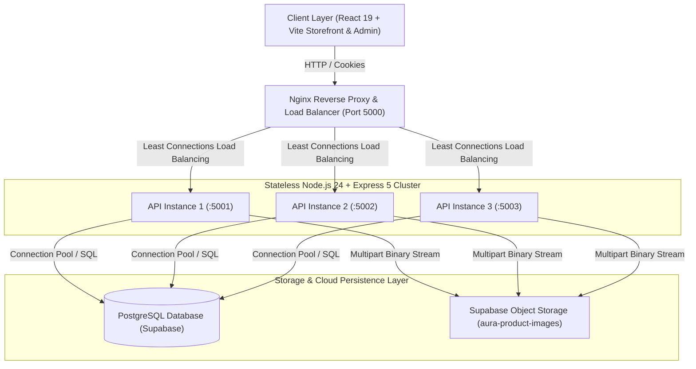

# AURA Studio Architecture & System Design



---

## 1. Architectural Layers & Separation of Concerns

```
backend/src/
├── routes/          # Clean URI routing & middleware chain attachment
├── middleware/      # Rate limiting, Helmet, CORS, Cookie Auth & Zod validation
├── validators/      # Strict Zod input contracts (body, params, query)
├── controllers/     # HTTP request / response parsing & ApiResponse normalization
├── services/        # Authoritative business logic, price engine, stock rules
├── repositories/    # Direct SQL & database transaction execution
├── database/        # PostgreSQL connection pool & resilient memory fallback
└── utils/           # Structured Pino logging, token hashing, custom AppError classes
```

### Layer Responsibility Matrix

1. **Routes Layer (`routes/`)**:
   - Declares URL patterns under `/api/v1`.
   - Never contains business logic. Attaches validation middleware and authentication guards.
2. **Validation Layer (`validators/`)**:
   - Zero-trust input sanitization using **Zod**.
   - Validates types, minimum lengths, email formats, and number ranges before controllers are touched.
3. **Controllers Layer (`controllers/`)**:
   - Extracts data from `req.body`, `req.params`, and `req.query`.
   - Delegates business workflows directly to domain services.
   - Formats responses using `ApiResponse.success` or `ApiResponse.created`.
4. **Services Layer (`services/`)**:
   - Encapsulates domain logic.
   - **Zero-Trust Pricing**: Ignores any prices provided by the frontend; loads canonical prices directly from PostgreSQL.
   - **Coupon Verification**: Enforces date ranges, minimum spends, and usage ceilings.
   - **Delivery Fee Logic**: Computes location-based shipping fees and applies free-delivery rules.
5. **Repositories Layer (`repositories/`)**:
   - Manages direct database access using parameterized SQL queries.
   - Wraps composite operations (e.g. checkout, stock deduction, patron aggregation) in database transactions (`BEGIN` ... `COMMIT` / `ROLLBACK`).

---

## 2. Stateless Load Balancer Readiness

### Core Design Requirements
* **Zero In-Memory Sessions**: Instances do NOT maintain sticky sessions or state in Node process memory.
* **Database-Backed Token Rotation**:
  - Access tokens are short-lived (15 minutes), stateless JWTs verified via cryptographic signature.
  - Refresh tokens are tracked via SHA-256 hashes in the `admin_refresh_tokens` table in PostgreSQL. Any instance can validate, rotate, or revoke tokens without sticky routing.
* **Atomic Concurrency Controls**:
  - Inventory decrements execute atomically:
    ```sql
    UPDATE products 
    SET stock_quantity = stock_quantity - $1 
    WHERE id = $2 AND stock_quantity >= $1
    RETURNING id, name, stock_quantity;
    ```
  - Prevents race conditions or negative inventory under burst shopping events across multiple concurrent server nodes.
* **Instance Tracking**:
  - Each instance broadcasts its identifier via the `X-Instance-ID` HTTP header and health check diagnostics.
* **Clean Connection Draining**:
  - Graceful shutdown handles `SIGTERM` and `SIGINT` signals, closing the HTTP listener and draining the `pg.Pool` connection pool before exit.

---

## 3. Storage Architecture: Decoupled Binary Media

* Per Supabase best practices, binary images are **never stored inside the relational database** as BLOBs or Base64 strings.
* Media files are streamed via `multer` memory storage directly to the dedicated **Supabase Storage** bucket (`aura-product-images`).
* Public CDN URLs are saved into the `product_images` table with ordering metadata and primary image flags.
